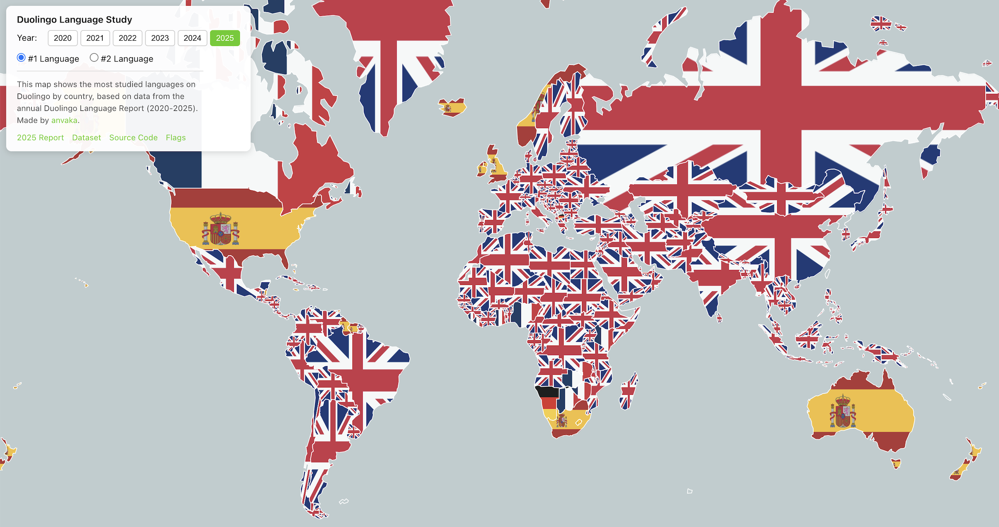

# Duolingo Language Map

Explore what languages people are learning on Duolingo around the world: https://anvaka.github.io/duolingo-study-map/

[](https://anvaka.github.io/duolingo-study-map/)

Each country displays a flag representing the most studied language. For example, if people
in Brazil are learning English, you'll see the British flag over Brazil.

# Features

* **Year slider (2020-2025)** - See how language preferences changed over time
* **Rank toggle** - View either the #1 or #2 most popular language per country
* **Shareable URLs** - Settings are saved in the query string (`?year=2023&rank=2`)
* **Hover tooltips** - See exact language data for each country

# How it works

The data comes from Duolingo's annual [Language Report](https://blog.duolingo.com/2025-duolingo-language-report/),
which reveals the most studied languages in each country.

The map is rendered with [MapLibre GL](https://maplibre.org/). For each country, I:

1. Load the country's polygon from Natural Earth GeoJSON data
2. Fetch the flag image for the most studied language
3. Clip the flag to the country's shape using canvas 2D
4. Render it as a raster layer on the map

Flag images are from [Flagpedia](https://flagpedia.net/).

# Data

The dataset is available as a [Google Spreadsheet](https://docs.google.com/spreadsheets/d/1CndYC5ZovYfmPuMN9T9Jxfa4CQXOzZrfQ2kAUaWG1ZU/edit?gid=532174835).
It contains the #1 and #2 most studied languages for 194 countries across 6 years.

Thank you [Dr. Cindy Blanco](https://blog.duolingo.com/author/cindy/) for creating the report and
pointing me to the data!

# Local development

```bash
# install dependencies
npm install

# serve with hot reload
npm run dev

# build for production
npm run build
```

# License

MIT
